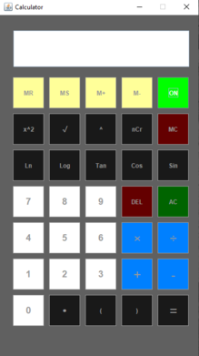

# Calculator
Calculator in Java using [Swing](https://www.javatpoint.com/java-swing)
  
## Requirements
Java version 8 or higher

## Running the project
1. Download this project to your computer using cmd
```sh
git clone https://github.com/mulugetaf/Calculator-using-swing.git
```
2. Imported it in [Intellij IDEA](https://www.jetbrains.com/idea/download/#section=windows) or any other Java IDE.

3. Run the application and start calculate

## Screenshots shows on & off mode
<table cellspacing="50" cellpadding="">
<tr>
  <td>Mode ON</td>
  <td>Mode OFF</td>
</tr>
<tr>
  <td></td>
  <td></td>
</tr>
  </table>

  
## Functionality and explanations 
1. The machine contains 35 pads squers.
2. Each mathematical operation parsing mathematical expressions specified in infix notation using [Shunting-yard algorithm](https://en.wikipedia.org/wiki/Shunting-yard_algorithm)
3. All mathematical rules are observed (handling edge cases like division by 0)
4. Each square represents a mathematical operation
5. Operation:
   * MR, MS, M+, M- (memory management)
   * Pow, Squer, nCr
   * ln, log, tan, cos, sin 
